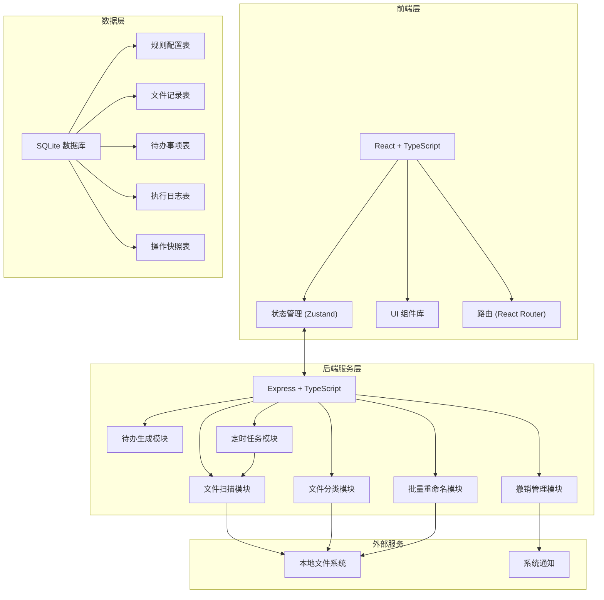
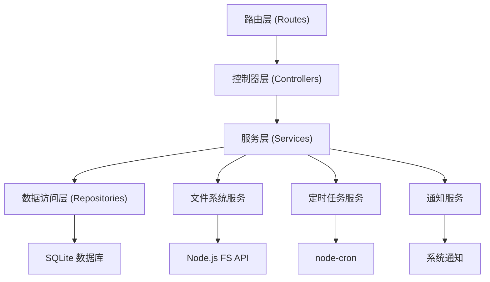
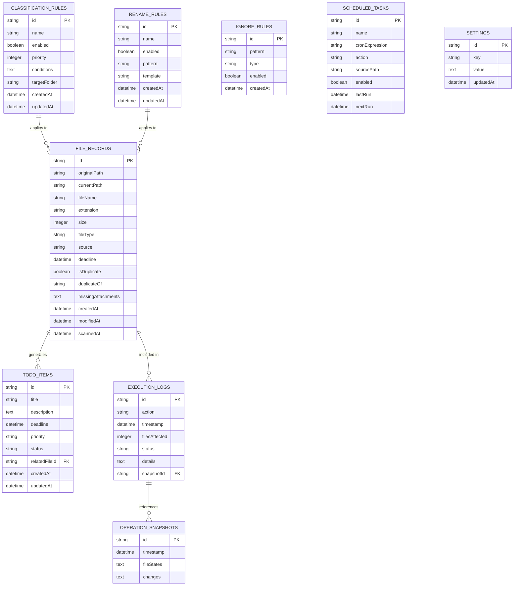

## 1. 架构设计



## 2. 技术描述

- **前端**：React@18 + TypeScript + Vite + TailwindCSS@3 + Zustand + React Router DOM
- **后端**：Express@4 + TypeScript + Node.js 文件系统 API
- **数据库**：SQLite + better-sqlite3（本地轻量存储，无需额外服务）
- **初始化工具**：vite-init (react-express-ts 模板)
- **图标库**：lucide-react
- **日期处理**：dayjs
- **文件处理**：Node.js fs/path 原生模块
- **定时任务**：node-cron
- **导出功能**：xlsx (Excel 导出)

## 3. 路由定义

| 路由 | 页面名称 | 功能描述 |
|------|----------|----------|
| / | 仪表板 | 统计概览、快捷操作、待办摘要 |
| /rules | 规则配置 | 分类/重命名/忽略/定时规则管理 |
| /scan | 文件扫描 | 目录选择、扫描进度、文件列表 |
| /preview | 分类预览 | 分类结果、文件预览、一键执行 |
| /rename | 批量重命名 | 命名模板、预览、批量执行 |
| /todos | 待办事项 | 智能识别结果、提醒管理 |
| /logs | 执行日志 | 操作历史、导出清单 |
| /settings | 系统设置 | 全局配置、忽略规则、定时设置 |

## 4. API 定义

```typescript
// 通用响应结构
interface ApiResponse<T> {
  success: boolean;
  data: T;
  message?: string;
}

// 文件信息
interface FileInfo {
  id: string;
  name: string;
  path: string;
  size: number;
  extension: string;
  createdAt: Date;
  modifiedAt: Date;
  type: 'invoice' | 'contract' | 'notice' | 'other';
  source?: string;
  deadline?: Date;
  isDuplicate?: boolean;
  missingAttachments?: string[];
}

// 分类规则
interface ClassificationRule {
  id: string;
  name: string;
  enabled: boolean;
  priority: number;
  conditions: {
    source?: string;
    filenamePattern?: string;
    dateRange?: { start: Date; end: Date };
    extensions?: string[];
    fileType?: string;
  };
  targetFolder: string;
}

// 重命名规则
interface RenameRule {
  id: string;
  name: string;
  enabled: boolean;
  pattern: string;
  template: string;
}

// 待办事项
interface TodoItem {
  id: string;
  title: string;
  description: string;
  deadline?: Date;
  priority: 'low' | 'medium' | 'high';
  status: 'pending' | 'in_progress' | 'completed';
  relatedFile?: string;
  createdAt: Date;
}

// 执行日志
interface ExecutionLog {
  id: string;
  action: string;
  timestamp: Date;
  filesAffected: number;
  status: 'success' | 'warning' | 'error';
  details: string;
  snapshotId?: string;
}

// API 端点
// GET    /api/scan?path={dir}           扫描目录
// POST   /api/scan/preview               生成分类预览
// POST   /api/classify/execute           执行分类
// POST   /api/rename/preview             生成重命名预览
// POST   /api/rename/execute             执行重命名
// GET    /api/rules                      获取所有规则
// POST   /api/rules                      创建规则
// PUT    /api/rules/:id                  更新规则
// DELETE /api/rules/:id                  删除规则
// GET    /api/todos                      获取待办事项
// POST   /api/todos                      创建待办
// PUT    /api/todos/:id                  更新待办状态
// GET    /api/logs                       获取执行日志
// POST   /api/logs/export                导出日志
// POST   /api/undo/:snapshotId           撤销操作
// GET    /api/settings                   获取系统设置
// PUT    /api/settings                   更新系统设置
```

## 5. 服务器架构图



## 6. 数据模型

### 6.1 数据模型定义



### 6.2 数据定义语言

```sql
-- 分类规则表
CREATE TABLE classification_rules (
  id TEXT PRIMARY KEY,
  name TEXT NOT NULL,
  enabled INTEGER DEFAULT 1,
  priority INTEGER DEFAULT 0,
  conditions TEXT NOT NULL,
  target_folder TEXT NOT NULL,
  created_at DATETIME DEFAULT CURRENT_TIMESTAMP,
  updated_at DATETIME DEFAULT CURRENT_TIMESTAMP
);

-- 重命名规则表
CREATE TABLE rename_rules (
  id TEXT PRIMARY KEY,
  name TEXT NOT NULL,
  enabled INTEGER DEFAULT 1,
  pattern TEXT NOT NULL,
  template TEXT NOT NULL,
  created_at DATETIME DEFAULT CURRENT_TIMESTAMP,
  updated_at DATETIME DEFAULT CURRENT_TIMESTAMP
);

-- 文件记录表
CREATE TABLE file_records (
  id TEXT PRIMARY KEY,
  original_path TEXT NOT NULL,
  current_path TEXT NOT NULL,
  file_name TEXT NOT NULL,
  extension TEXT NOT NULL,
  size INTEGER NOT NULL,
  file_type TEXT,
  source TEXT,
  deadline DATETIME,
  is_duplicate INTEGER DEFAULT 0,
  duplicate_of TEXT,
  missing_attachments TEXT,
  created_at DATETIME NOT NULL,
  modified_at DATETIME NOT NULL,
  scanned_at DATETIME DEFAULT CURRENT_TIMESTAMP
);

-- 待办事项表
CREATE TABLE todo_items (
  id TEXT PRIMARY KEY,
  title TEXT NOT NULL,
  description TEXT,
  deadline DATETIME,
  priority TEXT NOT NULL DEFAULT 'medium',
  status TEXT NOT NULL DEFAULT 'pending',
  related_file_id TEXT,
  created_at DATETIME DEFAULT CURRENT_TIMESTAMP,
  updated_at DATETIME DEFAULT CURRENT_TIMESTAMP,
  FOREIGN KEY (related_file_id) REFERENCES file_records(id)
);

-- 执行日志表
CREATE TABLE execution_logs (
  id TEXT PRIMARY KEY,
  action TEXT NOT NULL,
  timestamp DATETIME DEFAULT CURRENT_TIMESTAMP,
  files_affected INTEGER DEFAULT 0,
  status TEXT NOT NULL,
  details TEXT,
  snapshot_id TEXT,
  FOREIGN KEY (snapshot_id) REFERENCES operation_snapshots(id)
);

-- 操作快照表（用于撤销）
CREATE TABLE operation_snapshots (
  id TEXT PRIMARY KEY,
  timestamp DATETIME DEFAULT CURRENT_TIMESTAMP,
  file_states TEXT NOT NULL,
  changes TEXT NOT NULL
);

-- 忽略规则表
CREATE TABLE ignore_rules (
  id TEXT PRIMARY KEY,
  pattern TEXT NOT NULL,
  type TEXT NOT NULL,
  enabled INTEGER DEFAULT 1,
  created_at DATETIME DEFAULT CURRENT_TIMESTAMP
);

-- 定时任务表
CREATE TABLE scheduled_tasks (
  id TEXT PRIMARY KEY,
  name TEXT NOT NULL,
  cron_expression TEXT NOT NULL,
  action TEXT NOT NULL,
  source_path TEXT NOT NULL,
  enabled INTEGER DEFAULT 1,
  last_run DATETIME,
  next_run DATETIME,
  created_at DATETIME DEFAULT CURRENT_TIMESTAMP
);

-- 系统设置表
CREATE TABLE settings (
  id TEXT PRIMARY KEY,
  key TEXT NOT NULL UNIQUE,
  value TEXT,
  updated_at DATETIME DEFAULT CURRENT_TIMESTAMP
);

-- 索引
CREATE INDEX idx_file_records_path ON file_records(current_path);
CREATE INDEX idx_file_records_type ON file_records(file_type);
CREATE INDEX idx_todos_status ON todo_items(status);
CREATE INDEX idx_todos_deadline ON todo_items(deadline);
CREATE INDEX idx_logs_timestamp ON execution_logs(timestamp);
```
