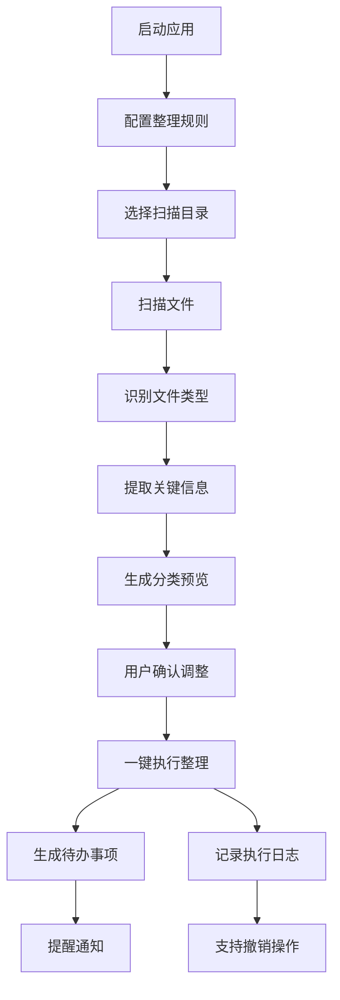

## 1. 产品概述

个人效率自动化工具是一款面向行政人员的文档智能管理系统，针对日常接收大量文档的工作场景，实现文件自动分类整理、智能识别与待办事项生成，大幅提升文档处理效率。

- 核心目标：解决行政人员文档分类繁琐、重要信息遗漏、待办事项混乱等痛点
- 目标用户：企业行政人员、办公室管理人员、文档处理专员
- 市场价值：将文档处理效率提升 80% 以上，减少人工分类错误，确保重要事项不遗漏

## 2. 核心功能

### 2.1 用户角色

| 角色 | 注册方式 | 核心权限 |
|------|----------|----------|
| 普通用户 | 本地应用启动 | 配置规则、扫描文件、执行整理、查看日志、导出数据 |

### 2.2 功能模块

1. **规则配置**：分类规则、重命名规则、忽略规则、定时任务配置
2. **文件扫描**：指定目录扫描、文件信息提取、类型识别
3. **分类预览**：按来源/文件名/日期/扩展名归类预览、移动结果预览
4. **批量重命名**：按规则批量重命名、命名冲突处理
5. **待办生成**：识别发票/合同/通知、提取截止日期、生成提醒事项
6. **执行日志**：操作记录、执行结果统计、异常信息展示
7. **异常处理**：合并重复文件、标记缺失附件、错误恢复机制

### 2.3 页面详情

| 页面名称 | 模块名称 | 功能描述 |
|----------|----------|----------|
| 仪表板 | 概览模块 | 统计卡片、快捷操作、最近活动、待办摘要 |
| 规则配置 | 规则管理 | 新增/编辑/删除分类规则、重命名规则、忽略规则、定时任务 |
| 文件扫描 | 扫描控制 | 选择目录、启动扫描、扫描进度、文件列表展示 |
| 分类预览 | 预览执行 | 分类结果树状展示、文件预览、拖拽调整、一键执行 |
| 批量重命名 | 重命名配置 | 命名模板配置、预览新名称、冲突检测、批量执行 |
| 待办事项 | 待办管理 | 智能识别结果、截止日期提取、提醒设置、状态管理 |
| 执行日志 | 日志查看 | 操作历史、执行详情、筛选搜索、导出清单 |
| 撤销恢复 | 撤销操作 | 操作记录、撤销确认、恢复上一状态 |

## 3. 核心流程

用户启动应用后，首先配置分类规则和重命名规则，然后选择收件文件夹进行扫描。系统自动识别文件类型、提取关键信息并生成分类预览。用户确认后一键执行整理，系统同时生成待办事项并记录操作日志，支持随时撤销操作。

## 4. 用户界面设计

### 4.1 设计风格

- **主色调**：深海蓝 (#1e3a5f) 代表专业与可靠
- **辅助色**：琥珀橙 (#f59e0b) 用于强调待办与提醒
- **成功色**：翡翠绿 (#10b981) 表示操作成功
- **警告色**：玫瑰红 (#ef4444) 用于异常提示
- **中性色**：石板灰系列 (#f8fafc, #f1f5f9, #cbd5e1, #64748b)
- **按钮风格**：圆角 8px，悬停阴影，过渡动画 0.2s
- **字体**：Display 字体使用 "Playfair Display"，正文字体使用 "Inter"
- **布局风格**：左侧导航 + 主内容区，卡片式布局，层次分明
- **图标风格**：使用 lucide-react 线性图标，统一 20px 尺寸

### 4.2 页面设计概述

| 页面名称 | 模块名称 | UI 元素 |
|----------|----------|---------|
| 仪表板 | 概览模块 | 渐变统计卡片、环形进度图、最近活动时间线、快捷操作按钮组 |
| 规则配置 | 规则管理 | 规则卡片列表、配置表单弹窗、开关切换、拖拽排序 |
| 文件扫描 | 扫描控制 | 目录选择器、扫描进度条、文件列表表格、文件类型统计图表 |
| 分类预览 | 预览执行 | 树状分类结构、文件预览面板、执行按钮、冲突标记 |
| 批量重命名 | 重命名配置 | 模板编辑器、实时预览、对比表格、执行确认 |
| 待办事项 | 待办管理 | 待办卡片、截止日期倒计时、优先级标签、状态切换 |
| 执行日志 | 日志查看 | 时间线布局、筛选器、详情展开、导出按钮 |
| 撤销恢复 | 撤销操作 | 操作记录卡片、变更对比、确认弹窗 |

### 4.3 响应式

- **桌面优先**：针对行政人员办公场景，优先优化 1440px 及以上桌面显示
- **平板适配**：1024px-1440px，导航折叠为图标模式
- **移动适配**：768px-1024px，底部 Tab 导航，内容垂直堆叠
- **触摸优化**：点击区域不小于 44x44px，滑动手势支持列表操作

### 4.4 视觉氛围

- **背景**：主背景使用轻微渐变纹理 (`linear-gradient(135deg, #f8fafc 0%, #f1f5f9 100%)`)
- **深度**：卡片使用多层阴影创造层次感，悬停时提升阴影强度
- **动效**：页面加载时元素依次入场动画，操作反馈使用微动效
- **细节**：添加微妙的噪声纹理覆盖层，提升质感
